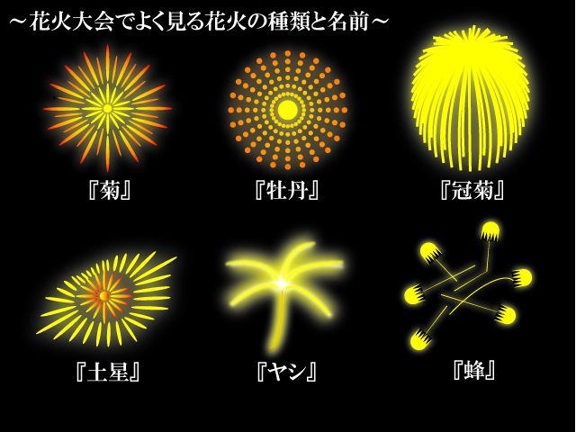

# 華美プロジェクト

麗美フィードバックエフェクト型サウンドゲーム  
jubeatやcytusのような音感ゲームをイメージ  
審査不要で開発サイクルが早いAndroidアプリから着手  
エフェクトにこだわりたいため、OpenGLESでシェーダガリガリ書く    
そのうちプライベートリポジトリに移行予定

## 特徴

* 基本楽曲は和楽曲メイン
* フィードバックのエフェクトが綺麗
* フィードバック時バイブレーション
* タイミングに合わせたフィードバック(Excellent,Good,OK,Bad)
* スコア(S〜Dランク、10万〜7万が合格ライン)
* コンボ(連鎖時の表記)
* 音声ファイルから譜面（ステージ）自動生成
* タイムライン(時系列のノーツ表示)
* 楽曲の難易度（Hard,Normal,Easy）
* 一時間内のプレイ回数制限（アプリ課金）
* 追加マーカ購入(アプリ課金)
* ステージ生成回数上限（アプリ課金）

タイムライン変換エンジンは初めに作って楽曲の難易度は後で修正できるフォーマットにする。  
タイムライン変換エンジンはバージョン分ける。  
→タイムライン変換エンジンのアルゴリズムが変わると譜面が変わるため
  
## ノーツ
  
 

*『菊』: 球状に飛散した花火の星が、菊の花びらのように尾を引いた形のものです。花火大会で一番よく見るのが、恐らくこの「菊」の形のものでしょう。他にも、中心に別の色の「芯」を入れて二重、三重にも輪を作る「芯入り菊」などもあります。
*『冠菊』(かむろぎく) : 菊の尾がより長く、ゆっくりと垂れていく花火を冠菊といいます。「しだれ柳」とも呼ばれているもので、花火大会のクライマックスなどに打ち上げられることが多い花火です。

●『牡丹』
先ほどの菊とは異なり、球状に飛散した星が尾を引かない花火が「牡丹」というタイプのものです。単色ではなく、中心の色の違う二重円のタイプが一般的です。

●『土星』
球状に飛散した花火の外側に、輪のような円を作る花火。その形が土星のようなので、こう呼ばれています。型物という、球状ではない形に開く花火の一つです。型物には、土星の他に蝶やハートの形のものがあります。

●『椰子』
椰子の木の葉のように、太い尾を引く星を八方に飛ばす花火です。この花火は昭和50年代に考案された、比較的新しい花火の形なのだそうです。

●『蜂』
花火の星がピューと四方八方に飛び散るのが「蜂」という花火です。確かに、勢い良く飛び散る星の動きは、蜂の巣をつついたときの騒ぎに似ていますね。

## 開発方針

1. 画面上にゲームオブジェクトを配置する
2. トップレベルの基本ゲームシステムを実装する
3. プレイヤーがゲームオブジェクトを操作できるようにする
4. 最小限のレベルを実装する
5. ギミックのロジックを実装する
6. ゲームのゴールを実装する
7. ユーザからのフィードバックを受けて、改修を行う
